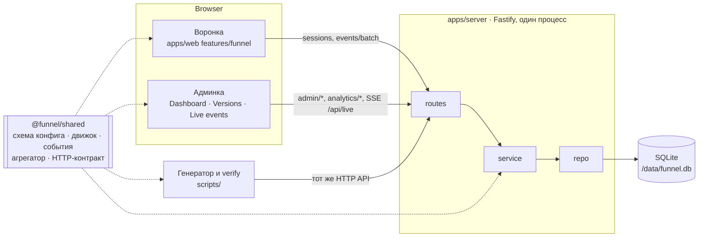
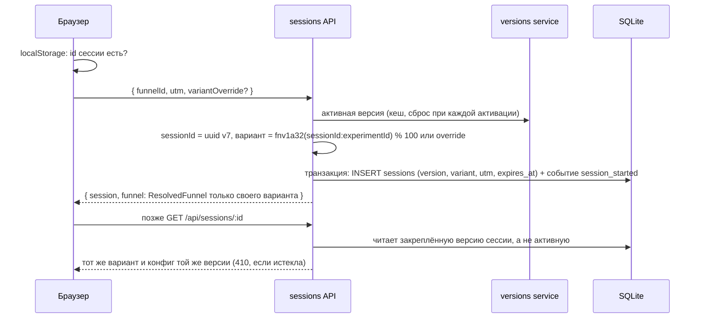
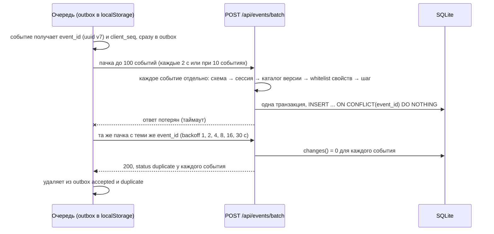
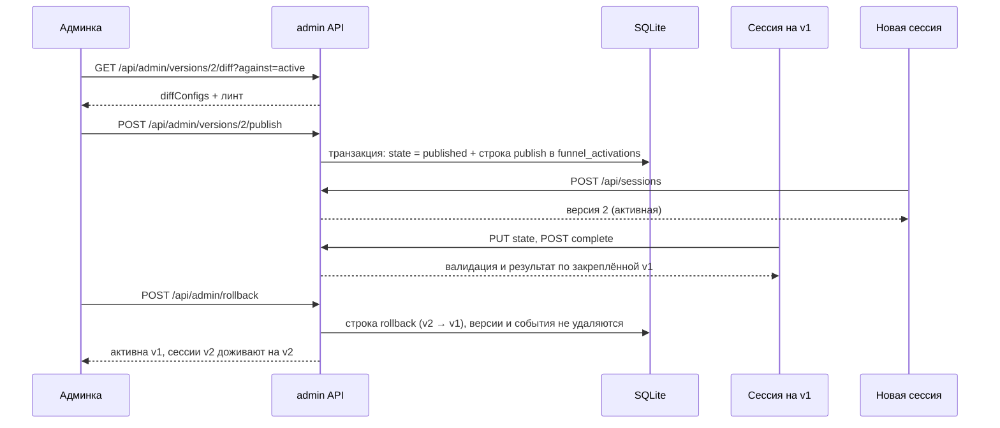

# Funnel Runtime

Мини-платформа для многошаговых веб-квизов: воронка целиком описана JSON-конфигом, версии публикуются и откатываются без передеплоя, события принимаются пачками с дедупликацией, дашборд считает воронку по уникальным сессиям.

[](https://github.com/Karez79/funnel-runtime/actions/workflows/ci.yml)

[Открыть воронку](https://app-production-183d.up.railway.app/) · [Админка](https://app-production-183d.up.railway.app/admin) · [Репозиторий](https://github.com/Karez79/funnel-runtime)

Демо-доступ к админке (Basic Auth): `admin` / `demo-875b44c4`

<!-- Скриншоты: docs/images/*, появятся в Фазе 8 (pnpm screenshots) -->

## Проверить за 5 минут

1. **Пройти воронку.** Откройте [воронку](https://app-production-183d.up.railway.app/), ответьте на вопросы до результата и нажмите CTA. Шаги, тексты и результат берутся из конфига активной версии; в коде нет ни одного вопроса.
2. **Refresh посередине.** На любом вопросе обновите страницу: откроется тот же шаг с теми же ответами (сессия на сервере, id сессии в `localStorage`, шаг в URL `/s/:stepId`).
3. **Back и ветвление.** Кнопка Back, `Esc` или браузерная «назад» возвращают на предыдущий видимый шаг. В вопросе о формате работы выберите `hybrid`: в пути появится шаг `office_days`, и «N of M» в прогрессе вырастет. Вернитесь назад и смените ответ на `remote`: шаг исчезнет, total уменьшится.
4. **Вариант B.** Откройте [`/?variant=B`](https://app-production-183d.up.railway.app/?variant=B): порядок вопросов и тексты варианта B. Override действует только при создании сессии и помечает её как QA.
5. **Debug.** Добавьте [`?debug=1`](https://app-production-183d.up.railway.app/?debug=1) (или Shift+D): id сессии, версия, вариант и его источник, видимый путь, `stateRev`, длина outbox, кнопка «Reset session».
6. **Публикация и откат.** Откройте [Versions](https://app-production-183d.up.railway.app/admin/versions). На проде v2 уже опубликована: её опубликовал прогон генератора с `--publish-next` (2026-10-02 04:31 MSK). Нажмите «Roll back to version 1», а потом «Roll back to version 2». Чтобы увидеть публикацию черновика, загрузите конфиг кнопкой «Upload config» или запустите приложение локально (после seed v2 — черновик): у черновика «Review changes» показывает diff и линт относительно активной версии, затем «Publish version 2». Откат возвращает к предыдущей версии по журналу активаций, поэтому второй откат возвращает v2. В подтверждении видно, сколько сессий останется на текущей версии. Новые сессии стартуют на активной версии, начатые остаются на своей.
7. **Live events.** Откройте [Live events](https://app-production-183d.up.railway.app/admin/live) и пройдите воронку в соседней вкладке: строки `accepted` появляются в реальном времени, повторно отправленные события — `duplicate`, отклонённые — `rejected` с причиной.
8. **Сверка с генератором.** Откройте [Dashboard](https://app-production-183d.up.railway.app/admin) и найдите в панели Data quality строку «Matches generator ground truth (last run, any filter)». Она показывает **Yes**: сервер пересчитывает проверки последнего прогона генератора на проде (2026-10-02 05:17 MSK, 150 сессий) и сравнивает их с его ground truth. На базе, где генератор не запускался, там стоит «Not run». Повторить локально: `pnpm dev`, затем `pnpm generate --publish-next` и `pnpm verify` (см. [ниже](#локальный-запуск)).

## Соответствие заданию

Полная таблица с путями и статусами — [`docs/REQUIREMENTS.md`](docs/REQUIREMENTS.md).

| Пункт задания                                                                  | Где реализовано                                                | Чем проверено                                         |
| ------------------------------------------------------------------------------ | -------------------------------------------------------------- | ----------------------------------------------------- |
| Экраны только из JSON, 5 типов шагов, ветвление, валидация, результат и CTA    | `packages/shared/src/engine/*`, `apps/web/src/features/funnel` | тесты движка, e2e `funnel.spec.ts`                    |
| Прогресс по доступным шагам, Back, refresh                                     | `engine/navigation.ts`, `features/funnel/session.ts`           | тест `progress`, e2e                                  |
| Публикация без передеплоя, активная версия, откат                              | `apps/server/src/modules/versions`, страница Versions          | тест 4, e2e `admin.spec.ts`, `demo:iteration2` (Ф. 7) |
| Версия закреплена за сессией, новые сессии только на активной                  | `apps/server/src/modules/sessions/service.ts`                  | тест 1, тест «preview не создаёт сессий»              |
| A/B внутри версии, назначение на сервере, стабильность, override               | `modules/sessions/assignment.ts`                               | тест 2                                                |
| Endpoint событий, идемпотентность, батчи, битое событие, приватность           | `modules/events/service.ts`, `packages/shared/src/events/*`    | тест 3                                                |
| Метрики по уникальным сессиям, A/B, версии, фильтр по `utm_campaign`           | `packages/shared/src/analytics/aggregate.ts`, Dashboard        | тест 5, `pnpm verify`                                 |
| Генератор: ≥100 сессий, UTM, A/B, ветки, отвалы, дубли, повтор пачки, порядок  | `scripts/generate-traffic.ts`                                  | `pnpm verify`, интеграционный тест                    |
| Вторая итерация (v3) без изменения схемы и без потери аналитики                | Фаза 7: загрузка v3 через админский API на работающий прод     | `demo:iteration2`, тест схемы, тест совместимости     |
| TS, React, Node, один репозиторий, SQLite, публичный URL, без внешних сервисов | монорепо pnpm, Fastify + React 19, SQLite на volume Railway    | CI, healthcheck после каждого деплоя                  |

## Архитектура



Всё, что используют и клиент, и сервер, живёт в `packages/shared` ровно в одном месте: формат конфига (zod), движок воронки (видимость, путь, прогресс, валидация, результат), схема событий и каталог, агрегатор метрик и HTTP-контракт (пути, методы, схемы запросов и ответов). Сервер регистрирует маршруты из контракта, веб-клиент и генератор вызывают API через тот же контракт. Границы слоёв (`routes → service → repo → db`, фичи веба не импортируют друг друга, `shared` не знает о Node и DOM) проверяет `dependency-cruiser` в `pnpm lint`. Подробнее — [`docs/ARCHITECTURE.md`](docs/ARCHITECTURE.md).

## Как это работает

### Создание сессии: закрепление версии и варианта



### Пачка событий: дедупликация и повтор после таймаута



### Публикация и откат при живых старых сессиях



**Семантика отката.** Откат меняет только то, на какой версии стартуют **новые** сессии. Сессии, начатые на откатываемой версии, продолжают работать на ней до завершения или истечения TTL, потому что версия закреплена за сессией. Версии и события никогда не удаляются, поэтому аналитика после отката не теряется. Откат отменяет последнее переключение по журналу активаций: повторный откат возвращает обратно (v2 → v1 → v2); любую опубликованную версию можно включить через «activate».

## A/B-эксперимент

Вариант B начинает с простых категориальных вопросов и откладывает числовые, а результат формулирует как конкретную проблему команды с CTA про план на 30 дней. Ожидание: меньше ранний отвал и больше кликов по CTA.

- **Основная метрика:** started → CTA по уникальным сессиям.
- **Вторичные:** result rate, CTA CTR, отвал на первых двух вопросах.
- **Guardrails:** доля сессий с Back, распределение результатов.
- **Решение:** только при p < 0.05 и достаточной выборке; дашборд показывает 95% интервал Уилсона, z-test, разницу в п.п. и нужный размер выборки, слова «wins» при p ≥ 0.05 не пишет.

Эффект в синтетических данных заложен генератором и показывает работу расчёта, а не продуктовый вывод. Подробно — [`docs/EXPERIMENT.md`](docs/EXPERIMENT.md).

## Модель данных, события и агрегация

- **Модель данных.** Шесть таблиц SQLite (версии, журнал активаций, сессии, события, журнал приёма, отклонённые события) плюс `ground_truth` для сверки с генератором. Всё, что зависит от конфига, лежит в JSON-колонках, поэтому новая версия конфига не требует миграции. Сырые ответы живут только в `sessions.state_json` и стираются после истечения сессии. [`docs/DATA_MODEL.md`](docs/DATA_MODEL.md)
- **События.** Семь базовых событий плюс каталог версии; `event_id` создаёт клиент, версию, вариант и UTM сервер берёт из сессии. Свойства фильтруются по whitelist, значений ответов в событиях нет. [`docs/EVENTS.md`](docs/EVENTS.md)
- **Агрегация.** Чистая функция `aggregate` из `@funnel/shared` считает всё по множествам уникальных сессий: дубли, Back и порядок прихода на числа не влияют. Та же функция считает ground truth генератора. [`docs/ANALYTICS.md`](docs/ANALYTICS.md)

## Локальный запуск

Нужны Node 24 (не ниже 24.2, см. `engines` в `package.json`) и pnpm из `packageManager` (`corepack enable`).

```sh
pnpm i
pnpm seed                     # v1 опубликована и активна, v2 — черновик
pnpm dev                      # сервер :3000 и Vite в watch-режиме
pnpm generate --publish-next  # 150 синтетических сессий, публикация v2 посередине
pnpm verify                   # сверка /api/analytics/summary с ground truth
pnpm test                     # unit и интеграционные тесты с порогами покрытия
pnpm e2e                      # Playwright smoke против собранного приложения
```

Сервер при старте сам применяет миграции и сидит базу, если версий нет, поэтому `pnpm seed` (то же действие без запуска сервера) на пустой базе необязателен; на базе с версиями он ничего не меняет. Локальные секреты по умолчанию: админка `admin` / `admin`, ключ генератора `dev-generator-key`.

### Генератор против публичного URL

```sh
export GENERATOR_KEY=… ADMIN_USER=admin ADMIN_PASSWORD=…
pnpm generate --base-url https://app-production-183d.up.railway.app --sessions 150 --seed 42 --publish-next
pnpm verify --base-url https://app-production-183d.up.railway.app
```

Переменные экспортируются один раз для обеих команд. `GENERATOR_KEY` нужен для синтетических сессий, учётные данные админа — для публикации следующего черновика, предпросмотра конфигов, загрузки ground truth на сервер и для `verify`, который читает `/api/analytics/summary`. Если сервер отклонил ключ или пароль, команда пишет одну строку с именем переменной, которую нужно экспортировать. Ключ генератора хранится в переменных Railway и в репозиторий не коммитится.

<details>
<summary>Переменные окружения</summary>

Читаются только в `apps/server/src/env.ts` (zod). В production сервер не стартует без `ADMIN_USER`, `ADMIN_PASSWORD` и `GENERATOR_KEY`. Шаблон — `.env.example`.

| Переменная                                 | По умолчанию                                      | Назначение                                                               |
| ------------------------------------------ | ------------------------------------------------- | ------------------------------------------------------------------------ |
| `PORT`                                     | `3000`                                            | порт HTTP                                                                |
| `HOST`                                     | `0.0.0.0`                                         | адрес прослушивания                                                      |
| `DATABASE_PATH`                            | `./data/funnel.db` (на Railway `/data/funnel.db`) | файл SQLite; на Railway лежит на volume `/data`                          |
| `WEB_DIST`                                 | `../web/dist`                                     | собранный фронтенд, который раздаёт тот же процесс                       |
| `ADMIN_USER`, `ADMIN_PASSWORD`             | dev: `admin` / `admin`                            | Basic Auth для `/admin`, `/api/admin/*`, `/api/analytics/*`, `/api/live` |
| `GENERATOR_KEY`                            | dev: `dev-generator-key`                          | заголовок `X-Generator-Key` для `trafficType: 'synthetic'`               |
| `RATE_LIMIT_SESSIONS`                      | `30`                                              | `POST /api/sessions` в минуту на IP (генератор с ключом освобождён)      |
| `RATE_LIMIT_EVENTS`                        | `120`                                             | `POST /api/events/batch` в минуту на IP                                  |
| `CLIENT_IP_HEADER`                         | production: `x-real-ip`, иначе пусто              | заголовок с IP клиента от edge платформы; пусто — адрес сокета           |
| `BUILD_VERSION` / `RAILWAY_GIT_COMMIT_SHA` | `dev`                                             | версия сборки в `/api/health`                                            |
| `LOG_LEVEL`                                | `info`                                            | уровень pino                                                             |
| `NODE_ENV`                                 | `development`                                     | `production` требует настоящих секретов                                  |

Генератор и `verify` читают `GENERATOR_KEY`, `ADMIN_USER`, `ADMIN_PASSWORD` из своего окружения.

</details>

<details>
<summary>Все команды</summary>

| Команда                | Что делает                                                      |
| ---------------------- | --------------------------------------------------------------- |
| `pnpm dev`             | сервер и веб в watch-режиме                                     |
| `pnpm build`           | сборка всего                                                    |
| `pnpm start`           | прод-запуск сервера, раздающего API и фронтенд                  |
| `pnpm test`            | Vitest во всех пакетах с порогами покрытия                      |
| `pnpm e2e`             | Playwright smoke против собранного приложения на временной базе |
| `pnpm typecheck`       | `tsc --noEmit` по всем пакетам                                  |
| `pnpm lint`            | ESLint, Prettier, Stylelint, dependency-cruiser, knip, jscpd    |
| `pnpm check`           | typecheck + lint + test + build — ворота CI и Stop-хука         |
| `pnpm db:generate`     | SQL-миграция из изменений `db/schema.ts` (drizzle-kit)          |
| `pnpm seed`            | v1 опубликована, v2 черновиком                                  |
| `pnpm generate`        | генератор синтетического трафика                                |
| `pnpm verify`          | сверка аналитики с ground truth                                 |
| `pnpm demo:iteration2` | сценарий второй итерации (Фаза 7)                               |
| `pnpm screenshots`     | скриншоты и анимация для README (Фаза 8)                        |

</details>

## Качество

`pnpm check` — одни и те же ворота локально, в Stop-хуке Claude Code и в CI на каждом PR; CI дополнительно гоняет `pnpm e2e`.

| Что гарантируется       | Чем                                                                                                                       |
| ----------------------- | ------------------------------------------------------------------------------------------------------------------------- |
| строгий TypeScript      | `tsc` со `strict`, `noUncheckedIndexedAccess`, `exactOptionalPropertyTypes`; ESLint `strictTypeChecked`, 0 предупреждений |
| границы слоёв           | `dependency-cruiser`: `shared` без Node и DOM, сервер `routes → service → repo`, фичи веба изолированы                    |
| нет мёртвого кода       | `knip`: неиспользуемые файлы, экспорты, зависимости                                                                       |
| нет копипасты           | `jscpd`: не выше 2%                                                                                                       |
| стили только из токенов | Stylelint: цвета, радиусы, тени, шрифты только через `var(--…)`                                                           |
| покрытие                | `packages/shared` ≥ 90% строк, `apps/server` ≥ 80%                                                                        |
| поведение в браузере    | Playwright e2e: воронка, админка, Live events                                                                             |
| прод после деплоя       | `verify-deploy.yml` ждёт `/api/health` с версией задеплоенного коммита                                                    |

## Таймлайн

Время MSK, подробности — [`docs/TIMELINE.md`](docs/TIMELINE.md). Конфиг v3 был в репозитории с самого начала; до Фазы 7 его не сидили, не публиковали и код под него не подгоняли.

| Фаза                                     | Начало             | Конец              | Итог                                                                                                                  |
| ---------------------------------------- | ------------------ | ------------------ | --------------------------------------------------------------------------------------------------------------------- |
| 0 — каркас, ворота, деплой               | 2026-10-01 16:16   | 2026-10-01 17:48   | монорепо, ворота качества, CI, Docker, Railway, прод `/api/health`                                                    |
| 1 — shared-движок                        | 2026-10-01 19:09   | 2026-10-01 20:45   | конфиг, условия, resolve, навигация, валидация, результат, линт, diff, контракт                                       |
| 2 — сервер: версии и сессии              | 2026-10-01 22:18   | 2026-10-01 23:47   | версии и журнал активаций, сессии с закреплением, тесты 1, 2, 4                                                       |
| 3 — воронка на фронте                    | 2026-10-02 00:03   | 2026-10-02 02:15 ¹ | все типы шагов, URL и Back, прогресс, результат, debug-оверлей, предпросмотр                                          |
| 4 — события                              | 2026-10-02 00:03   | 2026-10-02 03:01 ¹ | ingest с каталогом и whitelist, клиентская очередь, SSE `/api/live`, тест 3                                           |
| 5 — аналитика и админка                  | 2026-10-02 00:03   | 2026-10-02 01:55 ¹ | агрегатор и статистика (тест 5), Dashboard, Versions, Live events                                                     |
| 6 — генератор, verify, документация      | 2026-10-02 02:02 ² | 2026-10-02 04:28 ³ | генератор и ground truth, `pnpm verify`, строка сверки в дашборде, документы                                          |
| 6b — сверка, устойчивая к живому трафику | 2026-10-02 04:37   | 2026-10-02 04:59 ⁴ | проверки генератора считают только его трафик (`traffic=generator`): на проде в окно прогона попали посетители (#137) |
| 7 — вторая итерация (v3)                 | —                  | впереди            |                                                                                                                       |
| 8 — полировка                            | —                  | впереди            |                                                                                                                       |

¹ Фазы 3–5 шли параллельно. Конец — слияние последнего PR задачи в ветку фазы; в `main` фазы вливаются позже, по очереди (Фаза 5 — в 03:50).

² Начало работы над Фазой 6 (рабочая копия ветки фазы); milestone создан в 02:06.

³ Слияние Фазы 6 в `main` (#140, `c724c44`). Последний PR задачи (#133) влит в ветку фазы в 04:01, закрывающий PR документов (#135) — в 04:21; прогон генератора на проде — после слияния (#137).

⁴ Слияние последнего PR задачи (#145) в ветку фазы; слияние в `main` и повторный прогон генератора на проде — после (#137).

## Работа с агентами

Код писали и проверяли агенты Claude Code; человек код не читал. Проверку делали ворота качества (`pnpm check`), e2e, CI и субагент `reviewer` (`.claude/agents/reviewer.md`, только чтение), который оставлял в каждом PR комментарий с находками `blocker` / `major` / `minor`. Журнал — [`docs/AGENT_LOG.md`](docs/AGENT_LOG.md), решения вне спецификации — [`docs/DECISIONS.md`](docs/DECISIONS.md).

- **Декомпозиция.** На каждую фазу — [milestone](https://github.com/Karez79/funnel-runtime/milestones?state=all), на каждую задачу — issue, ветка `task/N.M-*` и PR в ветку фазы; фаза вливается в `main` merge-коммитом. Все PR — [закрытые pull request'ы](https://github.com/Karez79/funnel-runtime/pulls?q=is%3Apr+is%3Aclosed).
- **Параллельность.** Фаза 1 (контракт) шла последовательно. Фазы 3, 4 и 5 вели три агента-лида в отдельных `git worktree` одновременно; PR внутри фазы открывались стеком, ревьюеры работали параллельно с разработкой.
- **Что нашёл ревьюер (фазы 0–6, по `pnpm review:stats`).** Фаза 0: 1 blocker, 8 major — например, Stop-хук молча пропускал `pnpm check` после `cd`, правила dependency-cruiser не срабатывали. Фаза 1: 13 major, в итоговом ревью — имена из `Object.prototype` (`toString`) проходили линт как существующие шаги. Фаза 2: 3 major, среди них неограниченный рост кеша по публичному `funnelId` и обход rate limit подменой `X-Forwarded-For`. Фаза 3: 6 major, гонки быстрых нажатий во время view transition, воспроизведённые на прод-билде и закрытые e2e. Фаза 4: 0 major, 23 minor. Фаза 5: 5 major — например, Live events склеивал три копии события в одной пачке в одну строку. Фаза 6: 3 major — «Matches generator ground truth: Yes» мог быть пустым (проверка без сессий совпадала с пустым сервером), неверное время в таймлайне README и будущий прогон генератора на проде, описанный в README как уже состоявшийся; ещё e2e генератора поймал окно сверки, захватывавшее трафик предыдущей спеки.
- **Правила процесса.** PR с `blocker` или `major` вливается только после повторного ревью с APPROVE и зелёного CI; найденное исправляется сразу, в том же или следующем PR.
- **Хуки.** После правки файла — Prettier и ESLint `--fix`; на Stop — `pnpm check` (с кешем по отпечатку дерева), красный результат не даёт агенту закончить.
- **Ошибки процесса** записаны честно: стековый PR, закрытый GitHub при удалении базовой ветки; неверный диагноз ревьюера о сборке `better-sqlite3`, который исправил основной агент.

## Ограничения и допущения

Коротко: агрегатор считает в памяти, SQLite с одним писателем и один инстанс, Basic Auth вместо полноценной авторизации, override только при создании сессии, сессии на откатанной версии доживают на ней, время клиента не доверенное, порог in progress — 30 минут, сверка с генератором считает только трафик с его ключом (`traffic=generator`), чтобы посетители во время прогона на проде её не ломали. Полный список с причинами — [`docs/LIMITATIONS.md`](docs/LIMITATIONS.md).

<details>
<summary>Структура репозитория</summary>

```
funnel-runtime/
  CLAUDE.md                     спецификация проекта
  configs/                      funnel-v1.json, funnel-v2.json (итерация 1), funnel-v3.json (итерация 2)
  docs/                         ARCHITECTURE, DATA_MODEL, EVENTS, ANALYTICS, EXPERIMENT, LIMITATIONS,
                                TIMELINE, AGENT_LOG, DECISIONS, REQUIREMENTS, design/reference.html
  packages/shared/src/
    config/                     schema.ts (zod), lint.ts, diff.ts
    engine/                     conditions, resolve, navigation, validation, result
    events/                     schema.ts, catalog.ts, answerKind.ts
    analytics/                  aggregate.ts, stats.ts, summary.ts
    api/                        contract.ts, errors.ts, domain.ts
  apps/server/
    drizzle/                    сгенерированные SQL-миграции
    src/                        main.ts, app.ts, env.ts, clock.ts
      db/                       schema.ts, client.ts, migrate.ts, seed.ts
      modules/                  versions, sessions, events, analytics, live, retention, health
      plugins/                  auth, security, errors, sse, route, web
  apps/web/src/
    design/                     tokens.css, global.css, fonts.ts
    lib/                        api.ts, query.ts, storage.ts, viewTransition.ts
    ui/                         Button, Pill, Panel, Ring, HalfDonut, Dialog, CommandPalette, Toast, …
    features/                   funnel, admin-shell, versions, dashboard, live
  scripts/                      generate-traffic.ts, verify.ts; demo-iteration2.ts (Фаза 7), screenshots.ts (Фаза 8)
  e2e/                          Playwright smoke
  .claude/                      agents/reviewer.md, settings.json (хуки)
  .github/workflows/            ci.yml, verify-deploy.yml
  Dockerfile  railway.json  .env.example
```

</details>
