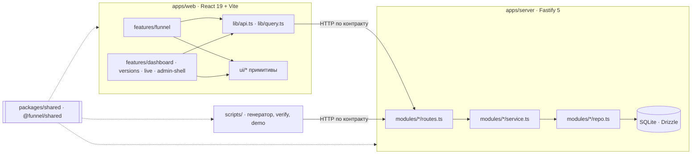

# Архитектура

Один репозиторий (pnpm workspaces), один серверный процесс, один URL. Сервер раздаёт и API, и собранный фронтенд; данные — в SQLite на volume Railway. Внешних сервисов нет.

## Модули

### `packages/shared` — контракт и чистая логика

Чистый TypeScript без Node и DOM, единственная зависимость — `zod`. Пакет экспортирует исходники через `src/index.ts`; глубокие импорты запрещены.

| Папка        | Что внутри                                                                                                                                                                                                    |
| ------------ | ------------------------------------------------------------------------------------------------------------------------------------------------------------------------------------------------------------- |
| `config/`    | `schema.ts` — zod-схема конфига (строгая к известным полям, терпимая к новым); `lint.ts` — ошибки, блокирующие публикацию, и предупреждения; `diff.ts` — список изменений между версиями                      |
| `engine/`    | `conditions.ts` (`all`/`any`/`not` и 10 операторов), `resolve.ts` (применение варианта), `navigation.ts` (`visiblePath`, `nextStep`, `progress`, `effectiveAnswers`), `validation.ts`, `result.ts`            |
| `events/`    | `schema.ts` — схема клиентского события, конверт пачки, причины отказа; `catalog.ts` — семь базовых событий и whitelist свойств; `answerKind.ts` — форма ответа без значения                                  |
| `analytics/` | `aggregate.ts` — все метрики дашборда; `stats.ts` — интервал Уилсона, z-test, размер выборки; `summary.ts` — форма ответа `/api/analytics/summary`                                                            |
| `api/`       | `contract.ts` — все маршруты (метод, путь, auth, схемы тела, query и ответа, лимит тела); `errors.ts` — типизированные ошибки домена и их HTTP-статусы; `domain.ts` — общие списки значений для zod и Drizzle |

Все функции движка и агрегатора чистые: время, seed и данные передаются параметрами.

### `apps/server` — Fastify

`app.ts` — корень композиции: создаёт `repo → service → routes` для каждого модуля, и это единственный файл, который видит все слои. `main.ts` склеивает процесс: env → БД → миграции → seed → HTTP → graceful shutdown по `SIGTERM`.

| Модуль      | Ответственность                                                                                                                                       |
| ----------- | ----------------------------------------------------------------------------------------------------------------------------------------------------- |
| `versions`  | загрузка конфигов, линт и diff, publish / activate / rollback в одной транзакции, кеш активной версии, preview                                        |
| `sessions`  | создание на активной версии, назначение варианта (`assignment.ts`), чтение по закреплённой версии, состояние, complete                                |
| `events`    | приём пачек: валидация по событию, каталог и whitelist версии сессии, обогащение из сессии, дедупликация                                              |
| `analytics` | выборка строк по фильтрам и вызов `aggregate`; список фильтров                                                                                        |
| `live`      | шина результатов приёма в памяти (последние 50; при старте заполняется из `events` и `rejected_events`) и SSE `GET /api/live` с heartbeat каждые 15 с |
| `retention` | очистка ответов истёкших сессий при старте и раз в час                                                                                                |
| `health`    | `GET /api/health`: версия сборки и проверка БД                                                                                                        |

Плагины: `auth.ts` (Basic Auth с `timingSafeEqual` или открытый доступ при `ADMIN_AUTH=off`), `security.ts` (helmet с CSP `default-src 'self'`, rate limit), `errors.ts` (единый формат `{ error: { code, message } }`), `route.ts` (регистрация маршрута из контракта), `sse.ts`, `web.ts` (раздача `apps/web/dist` и SPA-fallback).

### `apps/web` — React 19

React Compiler (ручной мемоизации нет), React Router в data-режиме, TanStack Query для серверного состояния, CSS Modules поверх `design/tokens.css`.

- `features/funnel` — воронка: сессия (`session.ts`), чистый редьюсер на функциях движка, реестр компонентов по `step.type` с `UnknownStep` для неизвестных типов, очередь событий (`eventQueue.ts`), `track` с проверкой каталога сессии, debug-оверлей, предпросмотр без сессии.
- `features/admin-shell`, `dashboard`, `versions`, `live` — админка. Отдельный чанк (`lazy`), бандл воронки её не тянет.
- `ui/*` — примитивы (Button, Pill, Ring, HalfDonut, Dialog, CommandPalette, Toast, …); не знают о фичах и API.
- `lib/api.ts` — типизированный клиент, построенный из `contract`; бросает тот же `DomainError`, что и сервер.

### `scripts/`

Генератор трафика, `verify`, `demo:iteration2`, скриншоты. Работают только через HTTP API и импортируют движок и агрегатор из `@funnel/shared`, а не повторяют их.

## Слои и границы

Правила проверяет `dependency-cruiser` (`.dependency-cruiser.cjs`) в `pnpm lint`:

- `shared` не импортирует `apps/*`, Node API и DOM; из внешних пакетов — только `zod`;
- `apps/web` и `apps/server` не импортируют друг друга; общее — через `@funnel/shared` и только через его `index.ts`;
- сервер: `routes → service → repo → db`; маршрут не ходит в репозиторий и БД, драйвер БД импортирует только репозиторий, сервис не знает о маршрутах, репозиторий — о сервисах и HTTP;
- веб: `ui/*` не знает о фичах и API, фичи не импортируют внутренности друг друга;
- циклических зависимостей нет.

## Единые источники правды

| Что                                                              | Где живёт                                          | Кто использует                                                      |
| ---------------------------------------------------------------- | -------------------------------------------------- | ------------------------------------------------------------------- |
| Формат конфига воронки                                           | `packages/shared/src/config/schema.ts`             | сервер (загрузка, линт), клиент (типы), генератор                   |
| Логика воронки (видимость, путь, прогресс, валидация, результат) | `packages/shared/src/engine/*`                     | сервер (валидация состояния, результат), клиент (рендер), генератор |
| Схема события и каталог                                          | `packages/shared/src/events/*`                     | ingest, клиентская очередь, генератор                               |
| Расчёт метрик и статистика                                       | `packages/shared/src/analytics/*`                  | API аналитики, ground truth генератора, `verify`, тесты             |
| HTTP-контракт и коды ошибок                                      | `packages/shared/src/api/contract.ts`, `errors.ts` | маршруты сервера, `lib/api.ts`, генератор                           |
| Схема БД                                                         | `apps/server/src/db/schema.ts`                     | репозитории; миграции генерирует drizzle-kit                        |
| Переменные окружения                                             | `apps/server/src/env.ts`                           | весь сервер                                                         |
| Дизайн-токены                                                    | `apps/web/src/design/tokens.css`                   | все стили (Stylelint запрещает сырые значения)                      |
| UI-примитивы                                                     | `apps/web/src/ui/*`                                | все экраны                                                          |

Типы выводятся (`z.infer`, `$inferSelect`), а не объявляются заново. Закрытые списки значений (состояния версий, действия активации, источники варианта, типы трафика) объявлены один раз в `shared/api/domain.ts`, варианты `A`/`B` — в `shared/config/schema.ts`; из них строятся и zod-перечисления контракта, и `CHECK` таблиц.

## Путь запроса: ответ → событие → дашборд

1. **Ответ.** Пользователь выбирает опцию. Компонент шага вызывает `onChange`; редьюсер воронки проверяет значение через `validateAnswer` и после Continue пересчитывает путь через `visiblePath` / `nextStep`.
2. **Состояние.** `PUT /api/sessions/:id/state` с `baseRev`: сервер проверяет ответы тем же `validateAnswer` по **закреплённой** версии сессии и увеличивает `state_rev` (при несовпадении — 409 с серверным состоянием). Сырые ответы остаются только в `sessions.state_json`.
3. **Событие.** `track('answer_submitted', stepId, { answer_kind })` проверяет, что событие есть в каталоге версии сессии, и кладёт его в outbox с `event_id` (uuid v7) и `client_seq`. Значения ответа в событии нет — только `answer_kind` (`single_select`, `multi_select:2`, `number`).
4. **Приём.** Очередь отправляет пачку в `POST /api/events/batch`. Сервер проверяет каждое событие отдельно, берёт версию, вариант и UTM из строки сессии, отбрасывает свойства вне whitelist и вставляет пачку одной транзакцией с `ON CONFLICT(event_id) DO NOTHING`. Результаты приёма уходят в шину Live events.
5. **Дашборд.** `GET /api/analytics/summary` выбирает сессии и события по фильтрам и вызывает `aggregate`, который сворачивает каждую сессию в профиль множеств и считает метрики по уникальным сессиям. Тот же `aggregate` считает ground truth генератора по его собственному журналу.

## Почему SQLite

- Задание требует SQLite, и на объёмах тестового задания одной базы в файле достаточно: один процесс, один писатель, транзакции через синхронный `better-sqlite3`.
- Дедупликация сводится к первичному ключу `event_id`, а публикация, откат и пачка событий — к одной транзакции без распределённых гарантий.
- WAL, `foreign_keys = ON`, `busy_timeout = 5000` включаются при открытии (`db/client.ts`).
- Цена — один инстанс и один писатель (см. [`LIMITATIONS.md`](LIMITATIONS.md)).

## Деплой

- **Образ.** Multi-stage `Dockerfile` на `node:24-slim`: сборка фронтенда, прод-зависимости сервера, `better-sqlite3` урезан до бинарника одной платформы. Сервер исполняется Node 24 прямо из `.ts` (type stripping), без отдельной сборки.
- **Railway.** `railway.json`: healthcheck `/api/health`, одна реплика, volume в `/data` (`DATABASE_PATH=/data/funnel.db`), сервер слушает `0.0.0.0:$PORT`. Автодеплой только из `main`, Railway ждёт зелёного CI.
- **Старт.** Миграции и seed выполняются при старте, а не при сборке: volume подключается только в рантайме.
- **Проверка прода.** `.github/workflows/verify-deploy.yml` на событии `deployment_status` ждёт, пока `/api/health` вернёт версию задеплоенного коммита.
- **Остановка.** По `SIGTERM` сервер перестаёт принимать запросы, закрывает SSE-потоки и базу; жёсткий дедлайн 10 с.
- **Безопасность.** Helmet с CSP `default-src 'self'` (шрифт бандлится из `@fontsource-variable/plus-jakarta-sans`), rate limit на `POST /api/sessions` и `POST /api/events/batch`, CORS выключен (всё same-origin), лимиты тела 256 КБ для событий и 64 КБ для состояния сессии.
