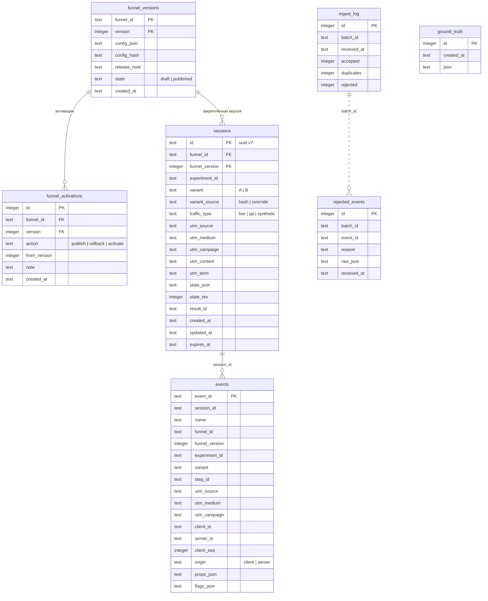

# Модель данных

SQLite, один файл (`DATABASE_PATH`, на Railway `/data/funnel.db`). Схема таблиц описана один раз в `apps/server/src/db/schema.ts` (Drizzle); SQL-миграции генерирует `pnpm db:generate` (drizzle-kit) в `apps/server/drizzle/`, они коммитятся и применяются при старте сервера. Ручных изменений схемы нет.

При открытии базы включаются `PRAGMA journal_mode = WAL`, `foreign_keys = ON`, `busy_timeout = 5000`.

`events.session_id` и `ingest_log`/`rejected_events` по `batch_id` связаны логически, без внешнего ключа: существование сессии проверяет сервис приёма до вставки, а отклонённое событие может не иметь ни сессии, ни `batch_id`.

Все времена — строки ISO 8601 в UTC.

## Таблицы

### `funnel_versions` — версии конфига

| Колонка                | Зачем                                                                                                                                              |
| ---------------------- | -------------------------------------------------------------------------------------------------------------------------------------------------- |
| `funnel_id`, `version` | первичный ключ; номер версии берётся из конфига, линт требует, чтобы он был больше всех существующих                                               |
| `config_json`          | исходный конфиг как есть. Всё, что зависит от конфига (шаги, каталог событий, свойства), читается отсюда, поэтому новая версия не требует миграции |
| `config_hash`          | sha256 конфига: повторная загрузка того же файла возвращает существующую версию (идемпотентность)                                                  |
| `release_note`         | заметка к версии, показывается в Versions                                                                                                          |
| `state`                | `draft` или `published`. Поле `status` внутри JSON источником правды не является                                                                   |
| `created_at`           | время загрузки                                                                                                                                     |

Версии неизменяемы и не удаляются.

### `funnel_activations` — журнал активаций

Только добавление строк. **Активная версия — `version` последней строки.** `action`: `publish` (черновик стал опубликованным и активным), `rollback` (возврат к `from_version` последней строки), `activate` (включение любой опубликованной версии). `from_version` — что было активно до этого; по нему работает откат. Публикация, откат и активация — одна транзакция вместе со сменой `state`. Откат — это новая строка, а не удаление.

### `sessions` — сессии

| Колонка                                      | Зачем                                                                                                                            |
| -------------------------------------------- | -------------------------------------------------------------------------------------------------------------------------------- |
| `id`                                         | uuid v7, создаёт сервер                                                                                                          |
| `funnel_id`, `funnel_version`                | версия, активная в момент создания, **закреплена навсегда**; внешний ключ на `funnel_versions`                                   |
| `experiment_id`, `variant`, `variant_source` | вариант назначается один раз: `hash` — `fnv1a32(sessionId + ':' + experimentId) % 100` по весам, `override` — из `?variant=`     |
| `traffic_type`                               | `live` по умолчанию; `qa` для override (скрыт в дашборде по умолчанию); `synthetic` для генератора (только с `X-Generator-Key`)  |
| `utm_*`                                      | фиксируются один раз при создании; пустые значения хранятся как `NULL`                                                           |
| `state_json`                                 | `{ answers, history, currentStepId }` — операционные данные для восстановления сессии, не аналитика                              |
| `state_rev`                                  | оптимистическая блокировка: `PUT state` с устаревшим `baseRev` получает 409; проверка повторена в `UPDATE … WHERE state_rev = ?` |
| `result_id`                                  | результат, вычисленный сервером в `POST /complete`; первый вычисленный остаётся                                                  |
| `created_at`, `updated_at`, `expires_at`     | `expires_at = created_at + session.ttlHours` закреплённой версии                                                                 |

Индекс `sessions_version_idx (funnel_id, funnel_version, variant)` — для счётчиков сессий по версиям и аналитики.

### `events` — принятые события

| Колонка                                                            | Зачем                                                                                                |
| ------------------------------------------------------------------ | ---------------------------------------------------------------------------------------------------- |
| `event_id`                                                         | первичный ключ, это и есть дедупликация: `INSERT … ON CONFLICT(event_id) DO NOTHING`                 |
| `session_id`, `name`, `step_id`                                    | что и где произошло                                                                                  |
| `funnel_id`, `funnel_version`, `experiment_id`, `variant`, `utm_*` | копируются **из строки сессии**, а не от клиента                                                     |
| `client_ts`, `client_seq`                                          | как прислал клиент; время клиента не доверенное и в метриках не используется                         |
| `server_ts`                                                        | время приёма; по нему считается последняя активность сессии                                          |
| `origin`                                                           | `server` у `session_started` (`event_id = 'srv:session_started:' + sessionId`), `client` у остальных |
| `props_json`                                                       | свойства после whitelist каталога версии; значений ответов здесь нет                                 |
| `flags_json`                                                       | `context_mismatch`, `out_of_order`, `dropped_props` (см. [`EVENTS.md`](EVENTS.md))                   |

Индексы: `events_session_idx (session_id)`, `events_agg_idx (funnel_id, funnel_version, variant, name)`, `events_campaign_idx (utm_campaign)`.

### `ingest_log` — итог каждой пачки

Одна строка на `POST /api/events/batch`: `accepted`, `duplicates`, `rejected`. Из неё панель Data quality берёт число проигнорированных дублей.

### `rejected_events` — отклонённые события

`reason` — одна из причин `REJECT_REASONS`. `raw_json` — только известные поля события, `properties` заменён списком ключей (значение могло быть сырым ответом), обрезано до 4 КБ по границе символа UTF-8.

### `ground_truth` — ground truth генератора

Добавляется в задаче 6.1 параллельно с этим документом.

| Колонка      | Зачем                                                                                                            |
| ------------ | ---------------------------------------------------------------------------------------------------------------- |
| `id`         | integer, автоинкремент                                                                                           |
| `created_at` | время загрузки                                                                                                   |
| `json`       | ground truth, загруженный генератором через `PUT /api/admin/ground-truth`: список проверок с ожидаемыми сводками |

Для строки дашборда «Matches generator ground truth» используется последняя строка. Сервер пересчитывает каждую проверку своим `aggregate` и сравнивает её с ожидаемой (см. [`ANALYTICS.md`](ANALYTICS.md#сверка-с-генератором)). Так сверка работает и на проде, где локального файла генератора нет.

## Приватность и очистка ответов

Сырые ответы живут только в `sessions.state_json`. Они никогда не попадают в `events` (там только `answer_kind`), не отдаются аналитическими API и не показываются в дашборде. Ошибки валидации состояния называют шаг и код, но не значение; логи pino значений ответов не пишут.

Модуль `apps/server/src/modules/retention` при старте сервера и затем раз в час очищает `answers` в `state_json` у сессий, у которых `expires_at` уже прошёл: `answers` становится `{}`. Строка сессии, её вариант, UTM, результат и все события остаются — аналитика не меняется. Строки с повреждённым JSON пропускаются, а не прерывают очистку; ошибка очистки пишется в лог и повторяется на следующем тике, сервер не останавливается. События истёкшей сессии по-прежнему принимаются (outbox и `sendBeacon` законно досылают их позже); истечение влияет только на восстановление ответов (`GET /api/sessions/:id` отвечает 410).

## Миграции и новые версии конфига

- Схема меняется только правкой `db/schema.ts` и `pnpm db:generate`; сгенерированный SQL коммитится.
- Мигратор Drizzle применяет новые файлы при старте сервера и ведёт учёт в своей служебной таблице. Volume Railway подключается только в рантайме, поэтому миграции не выполняются при сборке образа.
- Новая версия конфига — это строка в `funnel_versions`, а не миграция: шаги, результаты, каталог событий и свойства лежат в JSON-колонках. Тест в Фазе 7 сравнивает снимок `sqlite_master` до и после публикации третьей версии.
- Пустая база сидится при старте (`seedIfEmpty`): v1 опубликована и активна, v2 — черновик.
