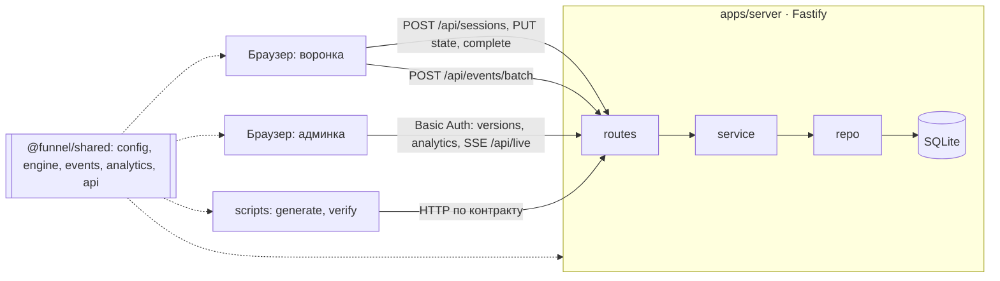

# Как это устроено: шпаргалка к разговору о коде

Воронка описана JSON-конфигом. Фронтенд рисует шаги по конфигу, сервер хранит версии конфига, закрепляет версию и A/B-вариант за сессией, принимает события пачками с дедупликацией, а дашборд считает воронку по уникальным сессиям. Всё работает в одном процессе Node на Railway, данные лежат в одном файле SQLite.

## Архитектура одной схемой

`packages/shared` — общий пакет на чистом TypeScript. Его импортируют браузер, сервер и генератор, поэтому правило описано один раз, а не три.

## Где лежит каждый источник правды

| Что                                                | Файл                                                     |
| -------------------------------------------------- | -------------------------------------------------------- |
| Формат конфига (zod)                               | `packages/shared/src/config/schema.ts`                   |
| Линт и diff версий                                 | `packages/shared/src/config/lint.ts`, `diff.ts`          |
| Логика воронки: условия, путь, прогресс, результат | `packages/shared/src/engine/*`                           |
| Схема события, каталог, `answerKind`               | `packages/shared/src/events/*`                           |
| Метрики и статистика                               | `packages/shared/src/analytics/aggregate.ts`, `stats.ts` |
| HTTP-маршруты и коды ошибок                        | `packages/shared/src/api/contract.ts`, `errors.ts`       |
| Схема БД (Drizzle)                                 | `apps/server/src/db/schema.ts`                           |
| Переменные окружения                               | `apps/server/src/env.ts`                                 |
| Дизайн-токены                                      | `apps/web/src/design/tokens.css`                         |

Границы проверяет `dependency-cruiser` в `pnpm lint`: маршрут не ходит в БД, `shared` не знает о Node и DOM, веб и сервер не импортируют друг друга.

## Путь «ответ → событие → дашборд»

1. Пользователь выбирает ответ и жмёт Continue. Редьюсер `funnelReducer.ts` проверяет значение `validateAnswer` и находит следующий шаг через `nextStep` по `visiblePath`.
2. Состояние уходит в `PUT /api/sessions/:id/state` с `baseRev`. Сервер (`modules/sessions/service.ts`, `saveState`) повторяет проверку по закреплённой версии. Если `baseRev` устарел, ответ 409 с серверным состоянием. Сырые ответы хранятся только в `sessions.state_json`.
3. `transitionEvents` в `funnelReducer.ts` формирует `answer_submitted` (только `answer_kind`, без значения) и `step_completed`. Трекер из `tracking.ts` пропускает событие, только если оно есть в каталоге версии сессии. Очередь `eventQueue.ts` кладёт его в outbox в `localStorage` с `event_id` (uuid v7) и `client_seq`.
4. Очередь шлёт пачку каждые 2 с или при 10 событиях, при скрытии вкладки — через `sendBeacon`. При сети или 5xx повторяет с задержкой 1, 2, 4… до 30 с с тем же `event_id`.
5. `modules/events/service.ts` проверяет каждое событие отдельно, берёт версию, вариант и UTM из строки сессии и отбрасывает свойства вне whitelist; `modules/events/repo.ts` вставляет пачку одной транзакцией с `onConflictDoNothing`, и `changes === 0` означает `duplicate`. Итог виден в Live events.
6. На последнем шаге `POST /api/sessions/:id/complete`: сервер (`complete` в `sessions/service.ts`) заново проверяет, что весь видимый путь отвечен, и сам считает результат `computeResult` по закреплённой версии. Клиент результат не считает: воронка ждёт ответа `complete` (показывая `loadingTitle`), а локально `computeResult` вызывается только в предпросмотре без сессии. Подменить результат сессии клиент не может.
7. `GET /api/analytics/summary`: `modules/analytics/service.ts` выбирает сессии и события по фильтрам и вызывает `aggregate` из `shared`. Тот же `aggregate` считает ground truth генератора по его журналу намерений.

## Почему SQLite

Задание требует SQLite, и для объёма тестового задания её достаточно. `better-sqlite3` синхронный, поэтому публикация, откат и пачка событий — это обычные транзакции в одном процессе. Дедупликация сводится к первичному ключу `events.event_id`. При открытии включаются WAL, `foreign_keys` и `busy_timeout = 5000` (`db/client.ts`). Цена: один инстанс и один писатель.

## Закрепление версии

`POST /api/sessions` всегда берёт активную версию. Вариант считает `assignVariant` в `modules/sessions/assignment.ts`: `fnv1a32(sessionId + ':' + experimentId) % 100` против весов вариантов. Версия, вариант и UTM записываются в строку `sessions` и больше не пересчитываются. `GET /api/sessions/:id` резолвит конфиг из закреплённой версии, а не из активной. TTL сессии — `session.ttlHours` из конфига (72 часа в v1 и v2); истёкшая сессия отвечает 410.

## Дедупликация

`event_id` создаётся на клиенте один раз и не меняется при ретраях. Повтор события или всей пачки упирается в первичный ключ: вставка ничего не меняет, а событие получает статус `duplicate`. Поэтому `sendBeacon`, который не возвращает ответ, безопасен: outbox дошлётся при следующем открытии. Аналитика считает множества сессий, поэтому порядок прихода тоже не важен.

## Публикация и откат

Активная версия — последняя строка журнала `funnel_activations` (только добавление). `publish` переводит черновик в published и пишет строку журнала в одной транзакции; ошибка линта блокирует публикацию. `POST /api/admin/rollback` активирует `from_version` последней строки журнала, это отмена последнего переключения; повторный откат возвращает обратно. Если предыдущей версии нет, ответ 409. Откат влияет только на новые сессии: начатые доживают на своей версии. Версии и события не удаляются, поэтому аналитика не теряется. Вторая итерация (конфиг v3) публикуется через `POST /api/admin/versions` на работающий сервер, без передеплоя и без новой миграции: всё, что зависит от конфига, лежит в JSON-колонках.

## 10 вероятных вопросов

1. **Может ли клиент подменить вариант или версию в событии?** Нет. Сервер берёт их из строки сессии, а расхождение помечает флагом `context_mismatch`.
2. **Что будет, если в пачке одно битое событие?** Конверт валиден — ответ 200. Битое событие получает `rejected` с причиной и попадает в `rejected_events`, остальные принимаются.
3. **Как считается отвал, если пользователь нажал Back?** По `furthestIndex` — самой дальней позиции в `stepSequence`, а не по последнему событию. Повторный просмотр шага не увеличивает reached.
4. **Почему живой пользователь не считается отвалившимся?** Сессия `live` без результата с активностью меньше 30 минут назад (`IN_PROGRESS_WINDOW_MS`) — In progress. Синтетика и QA этот порог не ждут.
5. **Где гарантия, что ответы не утекают в аналитику?** В событии есть только `answer_kind`. Свойства фильтруются по whitelist каталога, лишние ключи отбрасываются в `flags_json.dropped_props`. Ответы истёкших сессий очищает `modules/retention` при старте и раз в час.
6. **Как проверить, что дашборд считает правильно?** `pnpm generate` пишет ground truth той же функцией `aggregate`, но по своему журналу, а `pnpm verify` сверяет его с API. Генератор загружает ground truth на сервер (`PUT /api/admin/ground-truth`), и дашборд показывает «Matches generator ground truth». Проверки считают только трафик генератора (фильтр `traffic=generator`, строки с его ключом), поэтому настоящие посетители во время прогона сверку не ломают.
7. **Можно ли создать сессию на черновике ради предпросмотра?** Нет. `GET /api/admin/versions/:v/preview` отдаёт резолвнутый конфиг, фронтенд проходит его в памяти, без строк в `sessions` и `events`.
8. **Как работает `?variant=B`?** Override действует только при создании сессии: `variant_source='override'`, `traffic_type='qa'`. QA-сессии скрыты в дашборде, пока не включён «Include QA sessions».
9. **Почему A/B не сравнивается между версиями?** У каждой версии свой `experiment.id`. Версии сравниваются отдельной панелью Versions compared. Значимость: интервал Уилсона и z-test в `stats.ts`; при p ≥ 0.05 вердикт не объявляет победителя.
10. **Как защищены API?** Админка, аналитика и `/api/live` — Basic Auth с `timingSafeEqual`. Rate limit на IP: 30 созданий сессий и 120 пачек событий в минуту (по умолчанию, `env.ts`). Лимит пачки — 100 событий и 256 КБ, состояния сессии — 64 КБ. CSP `default-src 'self'`, внешних сервисов нет.
